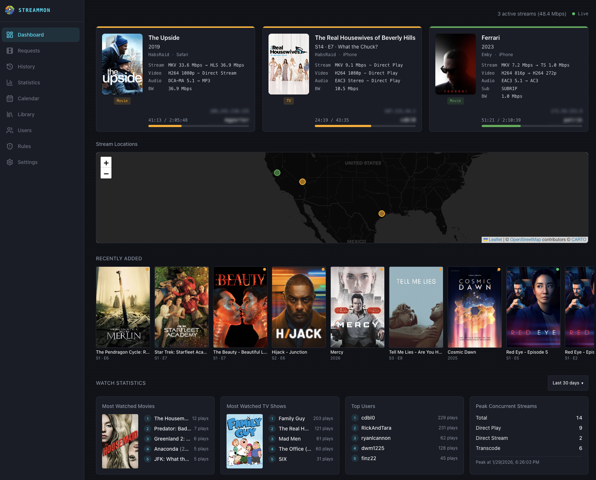
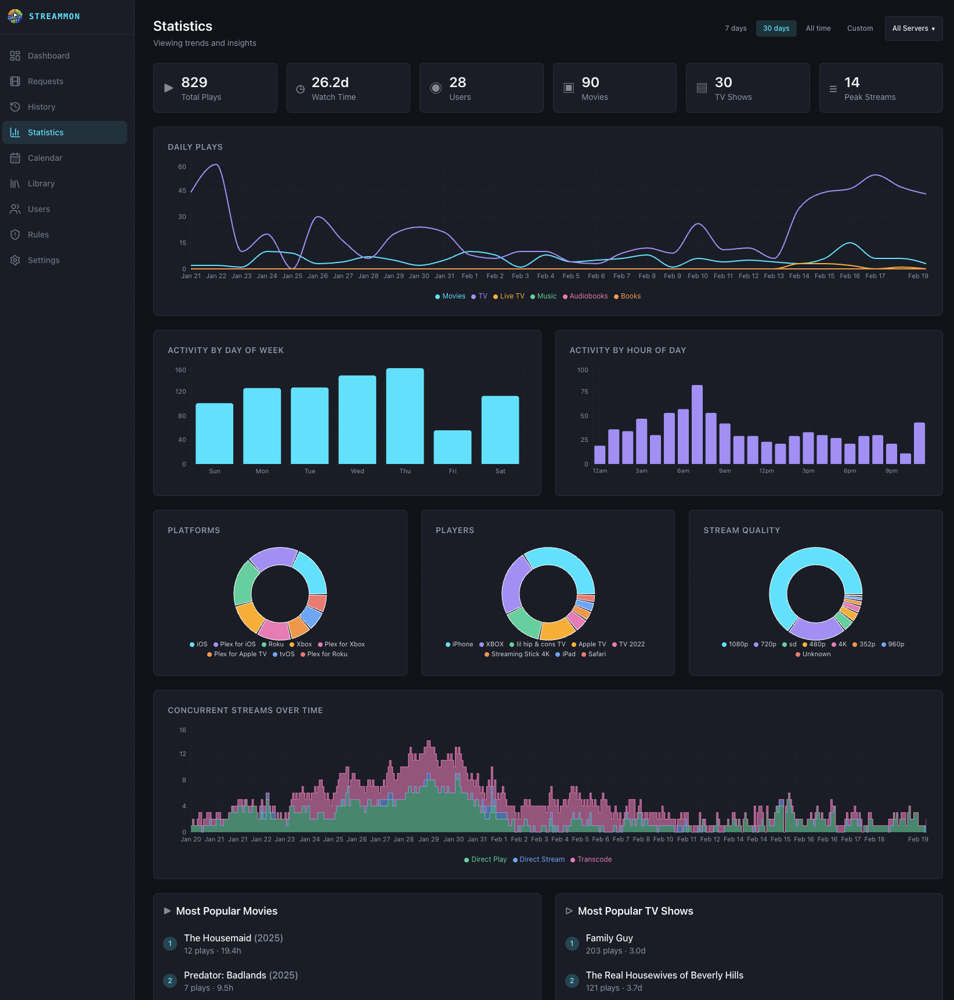
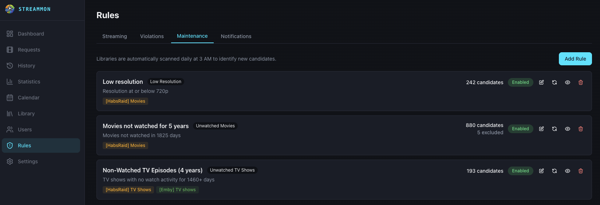

# StreamMon

StreamMon is a self-hosted media server management and monitoring platform for Plex, Emby, and Jellyfin. It provides real-time stream monitoring, watch history analytics, account sharing detection, library maintenance automation, and Overseerr / Seerr integration -- all packaged as a single Go binary with an embedded React frontend, deployed via Docker Compose.

Typical memory footprint is usually less than 20 MB. No runtime dependencies, no separate database process -- just a compiled Go binary with embedded SQLite and static frontend assets.

## Screenshots

| Dashboard | Statistics | Maintenance Rules |
|:---------:|:----------:|:-----------------:|
|  |  |  |

## Quick Start

### 1. Create a `docker-compose.yml`

```yaml
services:
  streammon:
    image: ghcr.io/darthnorse/streammon:latest
    container_name: streammon
    ports:
      - "7935:7935"
    volumes:
      - ./data:/app/data
      - ./geoip:/app/geoip
    environment:
      - TOKEN_ENCRYPTION_KEY=${TOKEN_ENCRYPTION_KEY}
    restart: unless-stopped
```

### 2. Generate an encryption key

This key is used to encrypt stored Plex tokens for Overseerr / Seerr user attribution. Run this command and copy the output:

```bash
openssl rand -base64 32
```

### 3. Create a `.env` file

Create a `.env` file in the same directory as your `docker-compose.yml` and paste the key from step 2:

```
TOKEN_ENCRYPTION_KEY=your-generated-key-here
```

### 4. Start the container

```bash
docker compose up -d
```

Open `http://localhost:7935` in your browser. On first launch you will be prompted to create an admin account.

## Features

**Real-Time Monitoring** -- Live stream dashboard with active session details, per-stream bandwidth and transcoding info, and a geographic stream map with IP geolocation.

**Watch History and Analytics** -- Full watch history with search and filtering, daily/weekly/hourly activity charts, per-user statistics, top media rankings, platform breakdowns, and concurrent stream tracking.

**Account Sharing Detection** -- Eight configurable rule types (concurrent streams, geo-restriction, impossible travel, simultaneous locations, device velocity, ISP velocity, new device, new location) with per-user trust scores, real-time evaluation, and violation history.

**Library Maintenance** -- Automated cleanup of unwatched, low-resolution, or oversized media with five criterion types, cascade deletion through Radarr/Sonarr/Overseerr, candidate review, and multi-library rule scoping.

**Overseerr / Seerr Integration** -- Search, discover, and request movies and TV shows with per-user attribution and admin approval workflow. Supports Plex, Jellyfin, and Emby via Seerr.

**Calendar** -- TV episode calendar powered by Sonarr with week and month views, poster art, air times, and availability status.

**Multi-Server Support** -- Plex, Emby, and Jellyfin from a single interface with per-server enable/disable and concurrent polling.

**Authentication** -- Local accounts, Plex, Emby, Jellyfin, and OIDC (Authentik, Authelia, Keycloak, etc.) with role-based access control, multi-provider account linking, and optional guest access.

**User Interface** -- Dark and light themes, mobile-first responsive design, configurable non-admin pages (Discover/Requests, My Stats, Calendar), and version update notifications.

## Documentation

Full documentation is available in the [Wiki](https://github.com/darthnorse/streammon/wiki), including:

- [Configuration](https://github.com/darthnorse/streammon/wiki/Configuration) -- Environment variables and data directories
- [Media Server Setup](https://github.com/darthnorse/streammon/wiki/Media-Server-Setup) -- Adding Plex, Emby, and Jellyfin servers
- [Authentication](https://github.com/darthnorse/streammon/wiki/Authentication) -- Provider setup and account linking
- [Overseerr / Seerr Integration](https://github.com/darthnorse/streammon/wiki/Overseerr-and-Seerr-Integration) -- Media requests and Plex token attribution
- [GeoIP Geolocation](https://github.com/darthnorse/streammon/wiki/GeoIP-Geolocation) -- Stream maps and location tracking
- [Sharing Detection Rules](https://github.com/darthnorse/streammon/wiki/Sharing-Detection-Rules) -- Rule types, trust scores, and household locations
- [Notifications](https://github.com/darthnorse/streammon/wiki/Notifications) -- Discord, webhooks, Pushover, and Ntfy
- [Library Maintenance](https://github.com/darthnorse/streammon/wiki/Library-Maintenance) -- Criteria, cascade deletion, and scheduling
- [Calendar](https://github.com/darthnorse/streammon/wiki/Calendar) -- Sonarr-powered episode calendar
- [Tautulli Import](https://github.com/darthnorse/streammon/wiki/Tautulli-Import) -- Importing historical watch data
- [Reverse Proxy](https://github.com/darthnorse/streammon/wiki/Reverse-Proxy) -- CORS and X-Forwarded-For setup
- [Development](https://github.com/darthnorse/streammon/wiki/Development) -- Building from source

## Tech Stack

- **Backend:** Go, Chi router, SQLite (WAL mode), SSE
- **Frontend:** React 18, TypeScript, Vite, Tailwind CSS, Recharts, Leaflet
- **Auth:** Local, Plex, Emby, Jellyfin, OIDC
- **Deployment:** Docker Compose, multi-stage build (Node 20 > Go 1.24 > Alpine)

## Acknowledgments

This project has been developed with AI assistance using [Claude Code](https://claude.ai/claude-code).

Thanks to [Tautulli](https://tautulli.com/), [Overseerr](https://overseerr.dev/) / [Seerr](https://docs.seerr.dev/), and [Tracearr](https://www.tracearr.com/) for their amazing work and inspiration.
